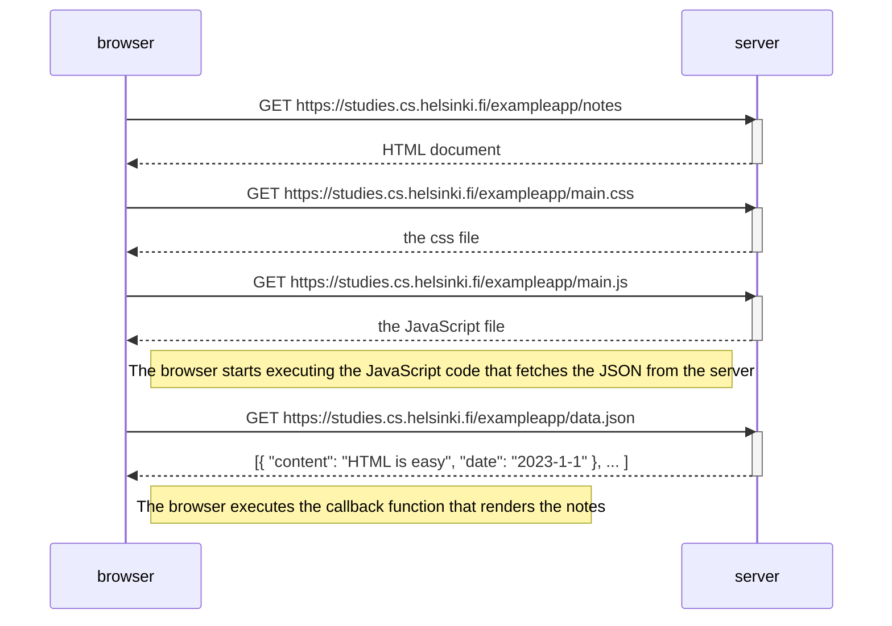

# FullStackOpen_Solutions_YouTube

YouTube Channel: https://www.youtube.com/@DevWithExcel

Check out my "Daily Code Challenges" with JavaScript : https://youtube.com/playlist?list=PLN9MjXT6ng174sZIEFhvuXi9fMseR5EQC&si=eix1pRMDoqEq4gGH

FullStackOpen | A brief Intro : https://youtu.be/XlrrpEk_wYw?si=2poq-pJz2irkqjO8

FullStackOpen | A quick update : https://youtu.be/ynfSoOnlkDg

FullStackOpen | Part 0 | sequenceDiagram | Exercise 0.4 - 0.6 : https://youtu.be/Mx47D3W_D9w

FullStackOpen | Part 1 | CourseInfo | Exercise 1.1a : https://youtu.be/rGdQNgZW-0I?si=nuCChAH7jdJfa-GJ

FullStackOpen | Part 1 | CourseInfo | Exercise 1.1b : https://youtu.be/cyFeGDM8ZgA?si=9Hi-huae6vi3xJl1

FullStackOpen | Part 1 | CourseInfo | Exercise 1.2 : https://youtu.be/1nJ8zt6EwcI?si=m7N__Ev-zsvNt2WP

FullStackOpen | Part 1 | CourseInfo | Exercise 1.3 : https://youtu.be/a9kW3-zWNHE?si=stDWmGCvmVJfNi-a

FullStackOpen | Part 1 | CourseInfo | Exercise 1.4 : https://youtu.be/XMlKLWOKiP0?si=iz2dQ4TiiC0yk18v

FullStackOpen | Part 1 | CourseInfo | Exercise 1.5 : https://youtu.be/qYRGaHa_IbY?si=KrA63sZcAQnIQWpY

FullStackOpen | Part 1 | UniCafe | Exercise 1.6 : https://www.youtube.com/watch?v=Z8VaDmDmRFY

FullStackOpen | Part 1 | UniCafe | Exercise 1.7 : https://youtu.be/rl4c8AxBAAo

FullStackOpen | Part 1 | UniCafe | Exercise 1.8 : https://youtu.be/-x4zpQ3BEfg

FullStackOpen | Part 1 | UniCafe | Exercise 1.9 : https://youtu.be/m5PMAO4TEfA

FullStackOpen | Part 1 | UniCafe | Exercise 1.10 : https://youtu.be/1AObjgp7Edo

FullStackOpen | Part 1 | UniCafe | Exercise 1.11 : https://youtu.be/h9H9v3HM98c

FullStackOpen | Part 1 | Anecdotes | Exercise 1.12 : https://youtu.be/oDYrXrnKvNg

FullStackOpen | Part 1 | Anecdotes | Exercise 1.13 : https://youtu.be/dt4qzeM0VwI

FullStackOpen | Part 1 | Anecdotes | Exercise 1.14 : https://youtu.be/dnIDtytV8NQ

FullStackOpen | Part 2 | CourseInfo| Exercise 2.1 : https://youtu.be/ujBQMdxXp3Y

FullStackOpen | Part 2 | CourseInfo | Exercises 2.2\_&_2.3 : https://youtu.be/etw7ZYGNNl4

FullStackOpen | Part 2 | CourseInfo | Exercise 2.4 : https://youtu.be/OqCKLUXumAw

FullStackOpen | Part 2 | CourseInfo | Exercise 2.5 : https://youtu.be/z3-4-Fy75As

FullStackOpen | Part 2 | PhoneBook | Exercise 2.6 : https://youtu.be/RGz8nm-VCsc

FullStackOpen | Part 2 | PhoneBook | Exercise 2.7 : https://youtu.be/JSTCG5ytp74

FullStackOpen | Part 2 | PhoneBook | Exercise 2.8 : https://youtu.be/NwK8qPv3384

FullStackOpen | Part 2 | PhoneBook | Exercise 2.9 : https://youtu.be/dvfI83q-cgA

FullStackOpen | Part 2 | PhoneBook | Exercise 2.10 : https://youtu.be/sK2NV3v7pCY

FullStackOpen | Part 2 | PhoneBook | Exercise 2.11(a) : https://youtu.be/SOPOGLa_2j8

FullStackOpen | Part 2 | PhoneBook | Exercise 2.11(b) : https://youtu.be/ijfZzPqpJdA

FullStackOpen | Part 2 | PhoneBook | Exercise 2.12 : https://youtu.be/ma4g3qqa26g

FullStackOpen | Part 2 | PhoneBook | Exercise 2.13 : https://youtu.be/UI9MLFyQZH4

FullStackOpen | Part 2 | PhoneBook | Exercise 2.14 : https://youtu.be/snfa43CFIp0

FullStackOpen | Part 2 | PhoneBook | Exercise 2.14(b) : https://youtu.be/ESqunSX8yG0

FullStackOpen | Part 2 | PhoneBook | Exercise 2.15 : https://youtu.be/y-f_5xUUkvs

FullStackOpen | Part 2 | PhoneBook | Exercise 2.16 : https://youtu.be/HIij47u21as

FullStackOpen | Part 2 | PhoneBook | Exercise 2.17 : https://youtu.be/8egNr06fYGk

FullStackOpen | Part 2 | PhoneBook | Exercise 2.18 : https://youtu.be/ovOcH4Wovrc

FullStackOpen | Part 2 | PhoneBook | Exercise 2.18(b) : https://youtu.be/8S6jYsDwe88

FullStackOpen | Part 2 | PhoneBook | Exercise 2.19 : https://youtu.be/MENJIj1f48Q

FullStackOpen | Part 2 | PhoneBook | Exercise 2.20 : https://youtu.be/ChndMlgDcIU

FullStackOpen | Part 3 | PhoneBook_Backend | Exercise 3.1 : https://youtu.be/w2GX2zCcAYQ

FullStackOpen | Part 3 | PhoneBook_Backend | Exercise 3.2 : https://youtu.be/uzZRFul7REo

FullStackOpen | Part 3 | PhoneBook_Backend | Exercise 3.3 : https://youtu.be/fBJhZeEvaCw

FullStackOpen | Part 3 | PhoneBook_Backend | Exercise 3.4 : https://youtu.be/MrSc7yPpCy0

FullStackOpen | Part 3 | PhoneBook_Backend | Exercise 3.5 : https://youtu.be/Ib3gPtU-P6s

FullStackOpen | Part 3 | PhoneBook_Backend | Exercise 3.6 : https://youtu.be/JkNi6BHeaEM

FullStackOpen | Part 3 | PhoneBook_Backend | Exercise 3.7 : https://youtu.be/5JaSe-PIJf4

FullStackOpen | Part 3 | PhoneBook_Backend | Exercise 3.8 : https://youtu.be/tnewuUN0_lo

FullStackOpen | Part 3 | PhoneBook_Backend | Exercise 3.9 : https://youtu.be/omOgkpvcl4c

FullStackOpen | Part 3 | PhoneBook_Backend | Exercise 3.10 : https://youtu.be/56zTxLndV0I

FullStackOpen | Part 3 | PhoneBook_Backend | Exercise 3.11 : https://youtu.be/uBqMEJC-pe0

FullStackOpen | Part 3 | PhoneBook_Backend | Exercise 3.12 : https://youtu.be/93G1E2r9gN8

